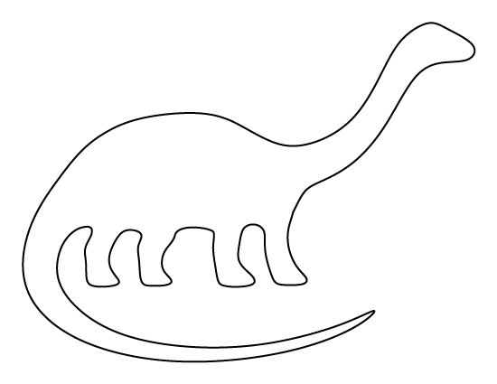

# simple-3d
[](https://travis-ci.org/nidi3/simple-3d)
[](https://codecov.io/gh/nidi3/simple-3d)
[](https://opensource.org/licenses/Apache-2.0)
[](https://maven-badges.herokuapp.com/maven-central/guru.nidi.simple-3d/simple-3d-jvm)
                                                                
## To see the models described here, go to https://nidi3.github.io/simple-3d

The github project is here: https://github.com/nidi3/simple-3d

A simple CSG library to create models for 3D printing.
Originally, the code is based on [csg.js](https://github.com/evanw/csg.js/).

This is a kotlin multi platform project, so it can be used from both javascript and kotlin.
The javascript part is currently unpolished,
but for an example what can be done, [see here](https://nidi3.github.io/simple-3d/docs). 

To use it with kotlin, add it as a dependency:

```xml
<dependency>
    <groupId>guru.nidi.simple-3d</groupId>
    <artifactId>simple-3d-jvm</artifactId>
    <version>0.0.1</version>
</dependency>
```
---

The basic element is the model. Objects are added to a model.
The model will be saved under the given file name, .stl and .obj formats are supported.
```kotlin 
model(
    File("examples/simple.stl"),
    cube(length = v(1, 2, 3)).rotateX(45.deg),
    sphere(center = v(3, 0, 0))
)
```

<script src="https://embed.github.com/view/3d/nidi3/simple-3d/master/examples/simple.stl"></script>
---

Objects can be combined with the `union` / `+`, `subtract` / `-` and `intersect` / `*` operators.
They can be translated, rotated and scaled. 
```kotlin
model(File("examples/csg.stl")) {
    val a = cube(center = v(1, 0, 0))
    val b = sphere()

    add(
        (a union b).translate(3, 0, 0),
        (a subtract b).translate(6, 0, 0),
        (a intersect b).translate(0, 0, 0)
    )
}
```

<script src="https://embed.github.com/view/3d/nidi3/simple-3d/master/examples/csg.stl"></script>
---

Transformations can be applied before adding objects to the model.
```kotlin
model(File("examples/transform.stl")) {
    val a = cube(length = v(1, 1, 2)) + cube(length = v(1, 2, 1))
    add(a)
    transformed(scale(.25, .25, .25)) {
        add(
            a.translate(0, 3, 3), a.translate(0, -3, 3),
            a.translate(0, 3, -3), a.translate(0, -3, -3)
        )
    }
}
```

<script src="https://embed.github.com/view/3d/nidi3/simple-3d/master/examples/transform.stl"></script>
---

When using the .obj format, materials can be assigned to objects.  
```kotlin
model(File("examples/material.obj")) {
    val red = material("red", Color(1.0, 0.0, 0.0))
    val green = material("green", Color(0.0, 1.0, 0.0))
    add(cube().material(red) - cube(center = v(.5, .5, 0)).material(green))
}
```

<script src="https://embed.github.com/view/3d/nidi3/simple-3d/master/examples/material.obj"></script>

Unfortunately, the viewer does not support materials :(

---

There is also a simple vectorizer which can be used to create models from images.
```kotlin
model(File("examples/dinosaur.stl")) {
    val img = Image.fromClasspath("brontosaurus-pattern.gif")
    val c = outline(img) { rgb -> rgb < 0xffffff }
        .simplify(5.0)
        .map { it.toVector() / 10.0 }
    add(prism(10, c))
}
```

<script src="https://embed.github.com/view/3d/nidi3/simple-3d/master/examples/dinosaur.stl"></script>
---

More examples can be found [here](https://github.com/nidi3/simple-3d/tree/master/src/jvmTest/kotlin/guru/nidi/simple3d/examples).
